# The game

*Knightmare* — in Japan *Majou Densetsu*, "legend of the demon castle" — is a
vertical shooter in armour. Popolon climbs through eight stages killing
monsters to rescue Aphrodite, and the cartridge pulls it off with a scenery
engine built in bands and three sprite slots it keeps reloading.

*The title screen, assembled by running the steps of `monta_el_titulo`
(0x47BA). The big logo is 33 tiles — eleven by three — written in a row by a
loop starting at tile 0x60.*

## The eight stages, in full

Each stage is a vertical strip of **61 bands of four rows**, that is 244 rows
of tiles. It is not stored as a map: it is assembled block by block.

Here are **all eight**, top to bottom and at full size: 256 x 1952 pixels each.
They come out of each stage's block codes and the 4x4 tile blocks at `0x9A6D`;
not one of them is a screen capture.

| | | | |
|:-:|:-:|:-:|:-:|
|  | 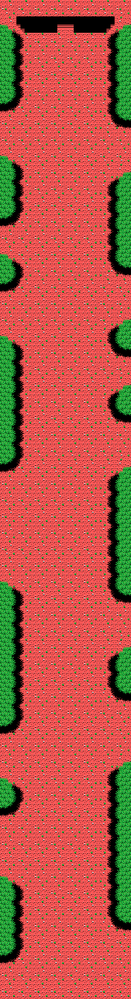 | 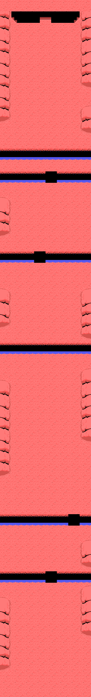 |  |
| **Stage 1** | **Stage 2** | **Stage 3** | **Stage 4** |
| 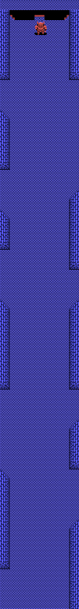 | 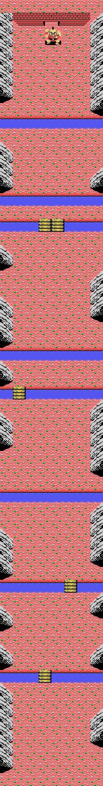 | 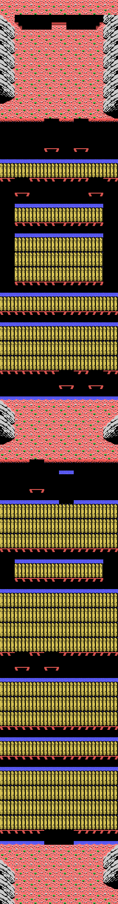 | 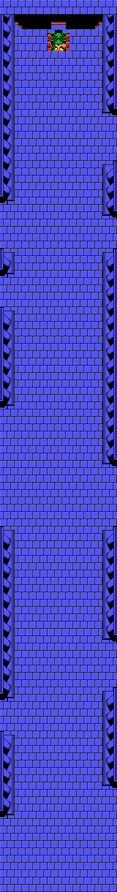 |
| **Stage 5** | **Stage 6** | **Stage 7** | **Stage 8** |

They read bottom to top, which is how they are played: Popolon comes in at the
bottom edge and climbs. The topmost band is the boss gate.

The builder is `0x6502` and it works like this:

- The stage is split into **ten sections**, and each section into **seven
  bands** of four rows.
- Each band is **eight groups of four columns**. Every group yields a block
  code: the low seven bits index the table at `0x99ED` — 64 pointers to 4x4
  tile blocks — and **bit 7 says the block goes mirrored**.
- After each group, an `rl` pulls one bit out of a bitmap: with the bit set the
  pointer moves on to the next block, with it clear **the previous block is
  repeated**. That is where the scenery compression lives.

And the blocks **overlap each other**: `0x9C21` and `0x9C3E` fall halfway into
another block, so one stretch of bytes serves as two different blocks.

## The rivers and the bridges do not belong to the stage

A stage's tile sheet **is not loaded by the stage alone**. Before building it,
`monta_el_marcador` (`0x565C`) uploads another block of 41 tiles — `0x27` to
`0x4F` — and its mirrored copy at `0x87`. That block is not just the bottom
panel: **the rivers and the bridges** live in it, the same in all eight stages,
which is why any stage's map uses them without carrying them.

Order matters: the panel first and the stage tiles **on top**, overwriting
`0x87` to `0x9F` of the panel's mirrored copy. Build the sheet with the stage
tiles alone and the bridges and rivers come out black.

## Three sceneries out of one colour script

Stage 4 uses the SAME tiles as stage 1. What changes is the palette.
Stages 0, 3 and 7 share the pattern script **and** the colour one. What tells
them apart is `(0xE661)`: the block reader (`0x443B`) translates five colour
codes — 0xE1, 0xEC, 0xE8, 0xE6 and 0xE5 — by subtracting 0x50, and another 0x50
when the bank is 2. One 640-byte block gives all three sceneries.

Stages 5 and 6 go further: they share tiles and colour, and **differ only in
the map**.

## Popolon is three sprites

*The twelve frames. The last four are the explosion.*

The figure is drawn with **three overlaid 16x16 sprites**: `0x5E2D` writes them
with patterns 0, 1 and 2. The first two are uploaded by the frame — each takes
**exactly 64 bytes**, that is two patterns — and the third is the first of the
stage's fixed bank. Each one's `y` and colour come from a six-byte block: three
`[y offset][colour]` pairs.

There are seven animations in the table at `0xA5B4`, and one of them — number 2
— alternates its colours with those at `0xA5EF` to make the invulnerability
blink.

## The bestiary does not fit at once

*The sixteen kinds of creature, one per block at `0xA993`, in the colour the
table at `0x7772` gives them.*

The MSX sprite sheet is 64 16x16 patterns and that is not enough, so the
cartridge keeps **three slots** — VRAM `0x1D00`, `0x1E00` and `0x1F00` — that
it reloads in turn: `0x78F9` decompresses four patterns into whichever is next
and also takes away the base pattern number, later added to each of the
creature's sprites.

Every enemy is drawn with **two sprites**, and the pair comes from the table at
`0x7772`: 38 eight-byte blocks with two `[dy][dx][pattern][colour]` entries.
From entry 5 on the pattern byte is **relative** — `0x7755` compares against 5
and only then adds `(ix+0x16)` — so a creature cannot be drawn without knowing
which slot it was loaded into.

And it can be known, because the type settles both: `(iy+0) & 0x0F` is what
`0x7914` uses to pick the block at `0xA993`, and it is also what `0x75E5` uses
to pick the subtable at `0x75F3` whose routines write `(ix+0x0A)`, the entry
into `0x7772`. Tie those two ends together and **it closes on its own**: the
patterns each type's entries ask for are exactly the ones its block carries,
not one more and not one fewer, in all sixteen.

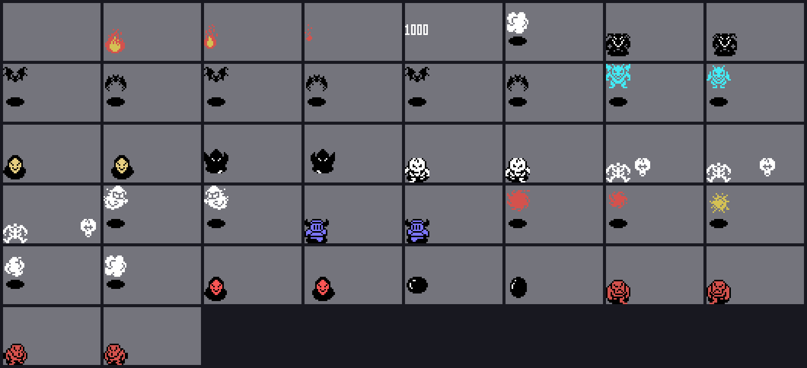

*The 42 frames of the table at `0x7772`, each with its type's block loaded in
the slot. The grey background is deliberate: most of these creatures are
colour-1 silhouettes, that is BLACK.*

Of a creature's two sprites the **first** one wins: `0x772A` writes them into
consecutive attributes, and on the TMS9918 the lower plane number covers the
other. Painted the other way round, the solid fill eats the silhouette.

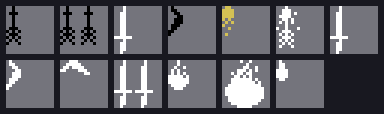

*The seven weapons of the table at `0x63FB`, a `[pattern][colour]` pair each.
Only the last two animate: `0x636D` gives them four frames with an `and 003h`.*

*The 37 fixed patterns `0x54BE` uploads at the start of every stage: the
weapons, the shots and the items. The same in all eight.*

## The bosses that come with a table

Two of the six bosses are assembled from a **whole table of sprites**, each
entry `[dy][dx][pattern][colour]`: the stage 1 one with seven (`0x902D`) and the
stage 3 one with nine (`0x9338`). And the pattern does not point into the fixed
bank: before painting itself, each boss **uploads its own** — `0x8E57` and
`0x9224`, with `descomprime_desde_la_palabra`, which carries the destination
inside the block — and both go to `0x1B00`, exactly the pattern `0x60` both
tables start from. Without that upload you get the fixed bank's weapons.

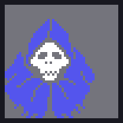
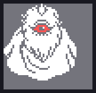

*The stage 1 one, with its eleven patterns, and the stage 3 one, with its
seventeen.*

The other four are **not here**: the stage 2 boss has three sets of six sprites
and `0x9186` adds its tail outside the table, and the stage 4 to 8 ones have not
been located. Still open.

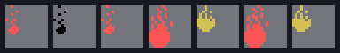

*The seven frames of a shot leaving, from the table at `0x8250`.*

## The scoreboard and the boss clock

*Exactly as it comes out of the emulator: the byte-for-byte check gives zero
differences.*

SCORE, HISCORE, REST and STAGE sit at the bottom, on row 22, and their digits
on row 23. The score is three BCD bytes from `0xE056` and the high score three
more from `0xE053`; when the high byte passes the threshold in `(0xE063)`,
`0x4305` hands over an extra life and raises the threshold by 0x10 — ten
thousand points — for the next one.

On the boss screen the lap counter is replaced by a **BCD clock** counting down
second by second: at four minutes the music changes, and at zero it is over.
