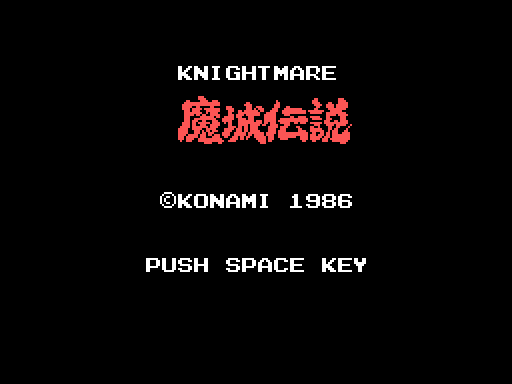
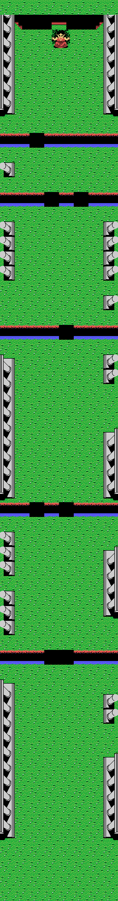
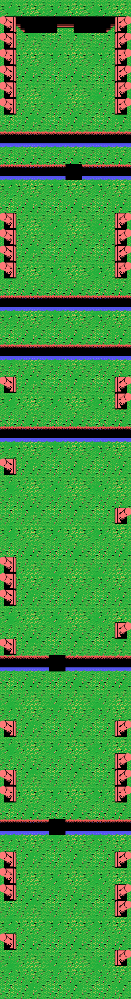
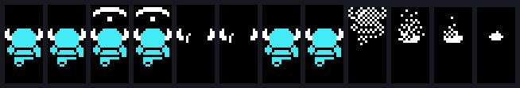
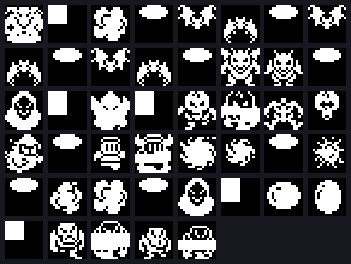
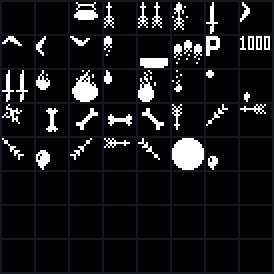
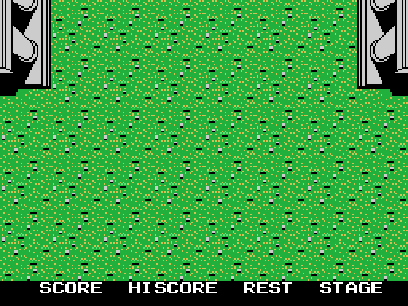

# El juego

*Knightmare* —en Japon *Majou Densetsu*, «la leyenda del castillo demoniaco»—
es un matamarcianos vertical con armadura. Popolon sube por ocho fases
matando bichos para rescatar a Aphrodite, y el cartucho lo resuelve con un
motor de decorado por bandas y tres ranuras de sprites que se van recargando.

*La pantalla del titulo, montada ejecutando los pasos de `monta_el_titulo`
(0x47BA). El rotulo grande son 33 casillas —once por tres— que un bucle escribe
seguidas desde la 0x60.*

## Las ocho fases, enteras

Cada fase es una tira vertical de **61 bandas de cuatro filas**, o sea 244
filas de casillas. No esta guardada como un mapa: se monta bloque a bloque.

*La fase 1 entera. Sale de los codigos de bloque de `0x9E51` y de los bloques
de 4x4 casillas de `0x9A6D`.*

El montador es `0x6502` y trabaja asi:

- La fase se parte en **diez tramos**, y cada tramo en **siete bandas** de
  cuatro filas.
- Cada banda son **ocho grupos de cuatro columnas**. De cada grupo sale un
  codigo de bloque: los siete bits bajos indexan la tabla de `0x99ED` —64
  punteros a bloques de 4x4 casillas— y **el bit 7 dice que el bloque va
  espejado**.
- Detras de cada grupo, un `rl` saca un bit de un mapa de bits: con el bit
  puesto el puntero avanza al bloque siguiente, y con el a cero **se repite el
  bloque anterior**. Ahi esta la compresion del decorado.

Y los bloques **se solapan entre si**: `0x9C21` y `0x9C3E` caen a medio bloque
de otro, asi que un mismo tramo de bytes sirve de dos bloques distintos.

## Tres decorados de un solo guion de color

*La fase 4 usa las MISMAS casillas que la 1. Lo que cambia es la paleta.*

Las fases 0, 3 y 7 comparten el guion de patrones **y** el de color. Lo que las
distingue es `(0xE661)`: el lector de bloques (`0x443B`) traduce cinco codigos
de color —0xE1, 0xEC, 0xE8, 0xE6 y 0xE5— restandoles 0x50, y otros 0x50 mas si
el banco es el 2. Un bloque de 640 bytes da los tres decorados.

Las fases 5 y 6 van mas lejos: comparten casillas y color, y **solo se
diferencian en el mapa**.

## Popolon son tres sprites

*Los doce fotogramas. Los cuatro ultimos son la explosion.*

El muneco se pinta con **tres sprites de 16x16** superpuestos: `0x5E2D` los
escribe con los patrones 0, 1 y 2. Los dos primeros los sube el fotograma —cada
uno ocupa **64 bytes justos**, o sea dos patrones— y el tercero es el primero
del banco fijo de la fase. La `y` de cada uno y su color salen de un bloque de
seis bytes: tres parejas `[ajuste de y][color]`.

Hay siete animaciones en la tabla de `0xA5B4`, y una de ellas —la 2— alterna
sus colores con los de `0xA5EF` para hacer el parpadeo de invulnerable.

## El bestiario no cabe entero

*Los 45 patrones de los dieciseis bloques de `0xA993`.*

La hoja de sprites del MSX son 64 patrones de 16x16 y no llegan, asi que el
cartucho tiene **tres ranuras** —VRAM `0x1D00`, `0x1E00` y `0x1F00`— que va
recargando por turno: `0x78F9` descomprime cuatro patrones en la que toque y se
lleva ademas el numero de patron base, que luego se le suma a cada sprite del
bicho.

Cada enemigo se pinta con **dos sprites**, y el par sale de la tabla de
`0x7772`: 38 bloques de ocho bytes con dos entradas `[dy][dx][patron][color]`.

*Los 37 patrones fijos que `0x54BE` sube al empezar cada fase: las armas, los
disparos y los objetos. Iguales en las ocho fases.*

## El marcador y el reloj del jefe

*Tal como sale del emulador: el cotejo byte a byte da cero diferencias.*

SCORE, HISCORE, REST y STAGE van abajo, en la fila 22, y sus cifras en la 23.
La puntuacion son tres bytes en BCD desde `0xE056` y el record otros tres desde
`0xE053`; cuando el byte alto pasa del umbral de `(0xE063)`, `0x4305` regala
una vida y sube el umbral 0x10 —diez mil puntos— para la siguiente.

En la pantalla del jefe el marcador de vueltas se cambia por un **reloj en
BCD** que baja segundo a segundo: al llegar a cuatro minutos cambia la musica,
y al llegar a cero se acabo.
